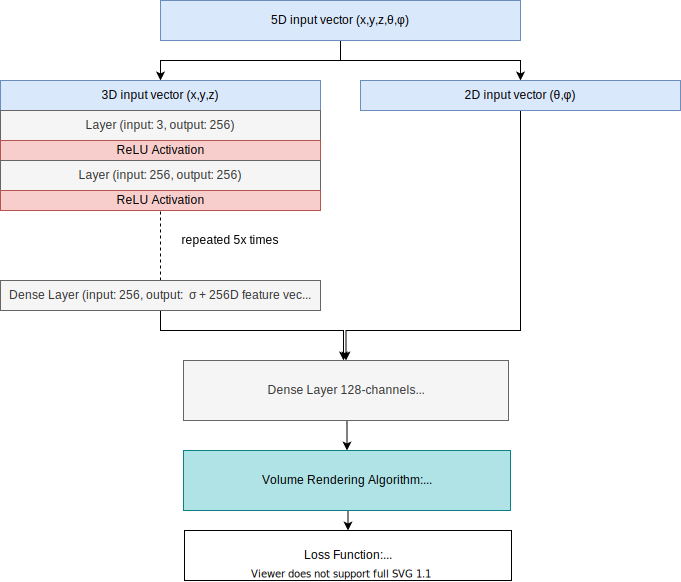
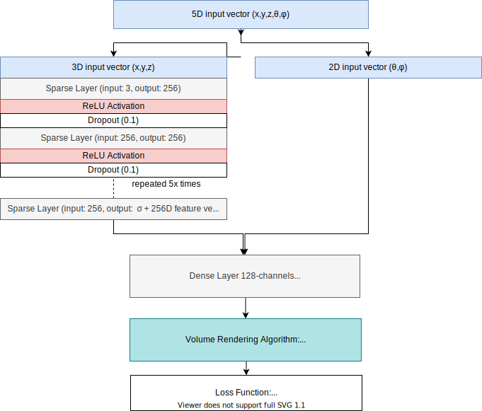

## Requirements

- Python version 3 or later
- Conda
- wget cli

## Setup Environment

```
conda env create -f environment.yml
conda activate prune_nerf
bash download_example_data.sh
bash create_log_folder.sh
```

## Running

Starting model training

```
python3 run_nerf.py --config config_fern.txt
```

Monitoring with tensorboard

```
tensorboard --logdir=logs/summaries --port=6006
```

## **Data Feed Pipeline**


## **NN Architecture**



### **Proposed Architecture**



## Sources

```
https://github.com/bmild/nerf
https://github.com/dcmocanu/sparse-evolutionary-artificial-neural-networks
```
